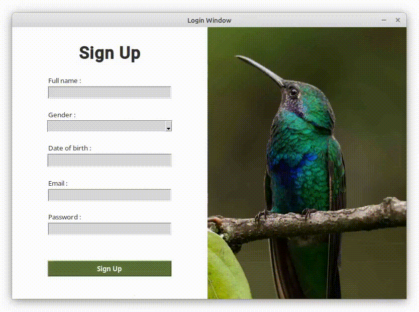

# Sign-up-System-and-UI
Sign up system and UI created in Python, and processing login data using the Pandas library

* Current screenshot preview of UI. I will continue to update the UI preview if there are any changes.





<b>Sign up data</b> will be saved at <mark>organizing_data/user_data.csv</mark>
or you can use the <b>template file</b> at <mark>organizing_data/template_data.csv</mark>

You can <b>process and analyze</b> the file at <mark>organizing_data/organize.ipynb</mark> using the <b>Pandas library</b>.

* Example
```python
import pandas as pd

# read file that store data from sign in menu
user_df = pd.read_csv("user_data.csv")

# or you can use a template file if you want to directly process and
# analyze data without having to enter data manually via the Sign in menu
user_df = pd.read_csv("template_data.csv")
```